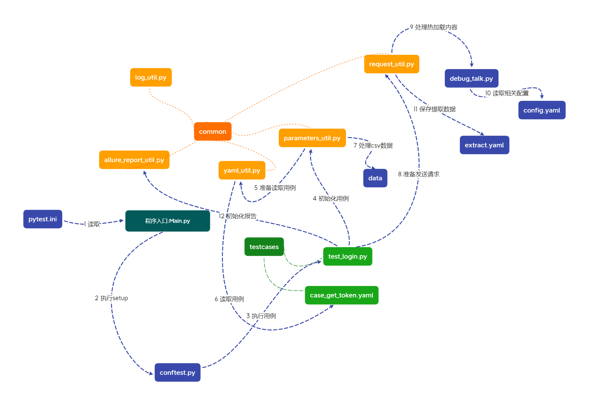

# Readme

## 1. 目录说明

~~~txt

.
├── common
│   ├── allure_report_util.py
│   ├── log_util.py
│   ├── parameters_util.py
│   ├── request_util.py
│   └── yaml_util.py
├── data
│   ├── login_data.csv
│   └── temp.csv
├── logs
├── report
│   ├── allure_report
│   └── allure_result
├── testcases
│   ├── login
│   │   ├── case_get_token.yaml
│   │   └── test_login.py
│   └── tag
│       ├── case_tag.yaml
│       └── test_tag.py
├── Readme.md
├── config.yaml
├── conftest.py
├── debug_talk.py
├── extract.yaml
├── main.py
└── pytest.ini

~~~

- common：通用功能模块

    1. allure_report_util.py：报告的一些配置方法
    2. log_util.py：封装了日志方法
    3. parameters_util.py：封装了参数格式化的方法
    4. request_util.py：封装了yaml数据分析和请求方法
    5. yaml_util.py：封装了yaml数据读取方法
- data: 存放数据驱动的csv文件
- report：测试报告
    1. allure_result：生成的allure报告，用于Jenkins等工具打开
    2. allure_report：生成的allure本地报告。
- testcases：测试用例
- debug_talk.py: 封装了热加载方法

- config.yaml：通用配置，如host
- conftest.py：pytest的conftest
- extract.yaml：存放临时使用的中间变量，如token
- pytest.ini：pytest配置文件
- main.py：程序入口



## 2. 测试用例文件yaml格式说明

~~~yaml
-
  report_info:  # 报告信息
    epic: wechat项目
    feature: 标签管理
    story: 分组名称xx
    tags: 
      - 标签1
      - 标签2
  name: 获取token
  des: 正常获取接口的信息
  host: WeChat
  parameters:
    name-des-method: /data/temp.csv
  request:
    url_path: /cgi-bin/token
    method: get
    headers: xx
    params: 
      grant_type: client_credential
      appid: wxd3bf30272b1def4f
      secret: 3df1dde2526a65de86c5e18db3f2d421
    data: {"tag": {"name": "方法"}}
    json: {"tag": {"name": "方法"}}    
    files:
      media: D:/wallpaper&rainmeter/109951165115690496.jpg    
  extract:
    access_token: '"access_token":"(.*?)"'
    expires_in: expires_in
    validata:
      - equals: {"status_code": 200}
      - equals: {"errcode": 42001}
      - contains: errmsg
~~~

1. 文件必须包含name、host、request节点；
2. des：接口的描述；
3. method：支持get、post等常用方法；
4. headers：请求头
5. params：get请求的参数；
6. data：post请求的普通参数；
7. json：post请求携带的json格式body；
8. files：上传的文件参数；
9. extract：此次请求需要保存到本地的参数，如token；
10. parameters: csv数据驱动文件路径和参数
11. validata: 断言关键字
12. report_info：allure报告的tag信息

## 3. 断言

目前支持两种断言方式：

- equals关键字：判断字段是否相等；

- contains关键字：响应结果是否包含对应的字段

```yaml
    validata:
      - equals: {"status_code": 200}  # 判断状态码是否等于200
      - equals: {"errcode": 42001}  # 判断errcode字段的值是否是42001
      - contains: errmsg  # 判断响应结果中是否包含errmsg字段
```

## 4. 热加载

yaml文件中可以使用方法的返回结果作为用例的某个值，比如生成随机数等。

可调用的方法封装在`debug_talk.py`文件中的`DebugTalk`类中。

yaml文件中输入`${method_name(*args)}`即可调用方法

示例：

`DebugTalk`类存在一个生成随机数的方法`ramdom_num()`

```yaml
-
  name: 获取token-${ramdom_num(100, 200)}  # ${ramdom_num(100, 200)}返回一个随机数
  des: 正常获取接口的信息
```

## 5. csv数据驱动

可以把不同的接口入参使用csv数据封装起来，然后再调用。

在parameters节点下需要使用csv驱动的参数使用 `-` 连接起来组成键，值是csv文件路径

如：`name-des-method: /data/temp.csv`，这里要使用数据驱动的参数是name、des、method。

> csv文件在项目根目录下的data文件夹中。

使用参数：`$csv{name}`

示例：

csv文件内容：

```csv
des,method,name
我是描述信息1,post,我叫xx
我是描述信息2,post,我叫dd
我是描述信息3,post,我叫cc
我是描述信息4,post,我叫bb
```

~~~yaml
-
  name: $csv{name}  # 使用csv中的name，第一条用例是 我叫xx
  des: $csv{name}  # 使用csv中的des，第一条用例是 我是描述信息1
  host: WeChat
  parameters:
    name-des-method: /data/temp.csv  # 读取/data/temp.csv内的数据作为name、des、method的参数
  request:
    url_path: /cgi-bin/token
    method: $csv{method}  # 使用csv中的method，第一条用例是 post
~~~

## 6. 接口关联（上下文）

yaml用例中包含extract节点，此节点下的数据将会提取到extract.yaml文件中。

- 字符串包含`(.*?)`或`(.+?)`将会使用正则提取响应结果
- 普通字符串使用json提取响应结果

```yaml
  extract:
    access_token: '"access_token":"(.*?)"'
    expires_in: expires_in
```

`'"access_token":"(.*?)"'`将会使用正则提取响应结果中`(.*?)`匹配的值，以`access_token`为键存储到extract.yaml；

`expires_in`以其作为json节点，提取对应的值，并以`access_token`为键存储到extract.yaml。
